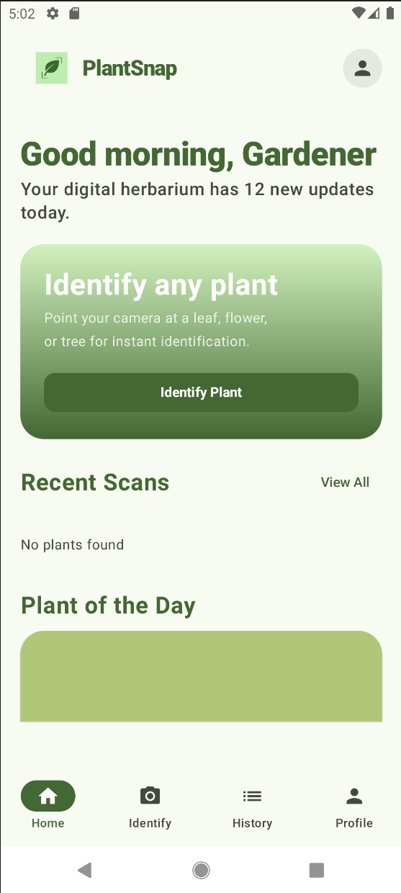
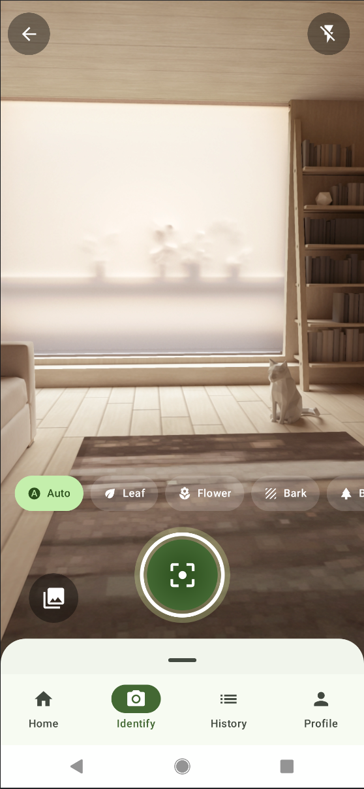
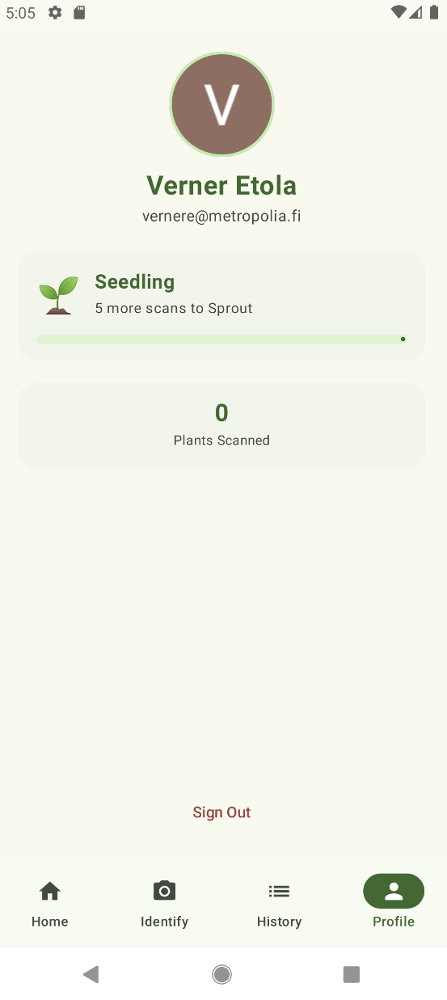

# PlantSnap

> AI-powered plant identification - 
> take a picture of any plant and get an instant species identification with safety information


PlantSnap is an Android application built with Kotlin and Jetpack Compose, 
as part of a six-week mobile development project by a team of Metropolia UAS software engineering students. 
Users can photograph a plant, select the relevant organ (leaf, flower, fruit or bark), and receive a list of species matches, 
powered by the PlantNet API, with additional details generated by Gemini AI.

---

## Screenshots





---

## Features

- **Live camera preview** - CameraX-powered viewfinder
- **Organ selector** - chip group for leaf, flower, fruit and bark
- **Gallery picker** - select existing photos via system media picker
- **Home screen** - recent scans list
- **Species identification** - PlantNet API integration
- **Results screen** - species list 
- **Toxicity warnings** - safety flags for dangerous species
- **Ai plant details** - Gemini generated care guides and habitat information
- **Profile page** - Supabase powered authentication with Google SSO 
- **Scan history** - local Room storage and cloud sync via Supabase
- **Favourites and streaks** - Profile gamification

---

## Architecture

PlantSnap is build on MVVM (Model-View-ViewModel) architecture

```
app/
└── src/main/java/com/plantsnap/
    ├── data/
    │   ├── local/          # Room database — ScanEntity, ScanDao, PlantSnapDatabase
    │   ├── remote/         # Retrofit services — PlantNetService, GeminiService
    │   └── supabase/       # Supabase auth and Postgrest repositories
    ├── domain/
    │   └── models/         # Domain models — ScanResult, PlantMatch
    ├── di/                 # Hilt dependency injection modules
    ├── navigation/         # Compose NavHost and route definitions
    └── ui/
        ├── screens/
        │   ├── home/       # HomeScreen + HomeViewModel
        │   ├── identify/
        │   │   └── camera/ # CameraScreen, CameraViewModel, CaptureButton, ShutterFlash
        │   ├── results/    # ResultsScreen + IdentificationViewModel 
        │   ├── history/    # HistoryScreen 
        │   ├── profile/    # ProfileScreen
        │   └── auth/       # Login + Register screens 
        ├── state/          # UiState sealed class (Idle, Loading, Success, Error)
        └── theme/          # Material 3 Digital Herbarium colour scheme + typography
```

---

## Technology

| Layer | Technology | Reason |
|---|---|---|
| UI | Jetpack Compose + Material 3 | Declarative UI, modern Android standard |
| Navigation | Compose Navigation | Type-safe routes, single-activity pattern |
| Camera | CameraX (`LifecycleCameraController`) | Lifecycle-aware, handles device fragmentation |
| Dependency Injection | Hilt 2.59.2 | Compile-time verified, integrates with ViewModel |
| Networking | Retrofit + OkHttp + Kotlinx Serialization | Type-safe API calls, efficient JSON parsing |
| Local Storage | Room + DataStore | Structured scan history, preferences |
| Cloud | Supabase (Auth + PostgreSQL) | Auth + real-time sync without custom backend |
| Image Loading | Coil 3 | Kotlin-first, Compose-native |
| Plant Identification | PlantNet API | Open, well-documented, 30,000+ species |
| AI Detail | Gemini API | Structured plant information generation |

---

## Setup

### Prerequisites
- Android studio Meerkat or later
- JDK 11
- Android emulator or device running API 26+

### 1. Clone the repository

```bash
git clone https://github.com/<your-username>/PlantSnap.git
cd PlantSnap
```
### 2. Add API keys

Create a 'local.properties' file in the project root

```properties
PLANTNET_API_KEY=your_plantnet_api_key
SUPABASE_URL=your_supabase_project_url
SUPABASE_KEY=your_supabase_anon_key
GOOGLE_SERVER_CLIENT_ID=your_google_oauth_client_id
```

- **PlantNet API key** - register at [my.plantnet.org](https://my.plantnet.org)
- **Supabase credentials** - create a project at [supabase.com](https://supabase.com)
- **Google Client ID** - configure OAuth in Google Cloud Console

### 3. Run

Open the project in Android Studio and run the 'app' configuration on an emulator or connected device.

---

## Testing

```bash
# Unit tests
./gradlew test
 
# Instrumented UI tests (requires emulator or device)
./gradlew connectedDebugAndroidTest
 
# Coverage report
./gradlew jacocoTestReport
```

Tests are also run automatically on every push to 'main' via GitHub Actions. The CI pipeline runs lint, 
build the depub APK, and executes instrumented tests on an API 35 emulator

---


## Tech stack

```
Language        Kotlin
Min SDK         26 (Android 8.0)
Target SDK      36 (Android 16 preview)
UI              Jetpack Compose + Material 3
DI              Hilt 2.59.2
Camera          CameraX 1.4.1
Database        Room 2.8.4
Networking      Retrofit 2.11.0 + OkHttp 5.3.0
Serialization   Kotlinx Serialization 1.7.3
Auth + Cloud    Supabase 3.1.1
Build           Gradle 9.2.1 + AGP 9.0.1
CI              GitHub Actions
```

---

## License

This project is developed for academic purposes as part of a mobile development course.