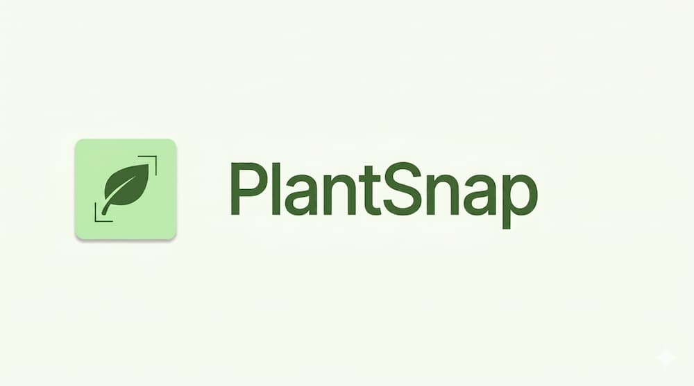
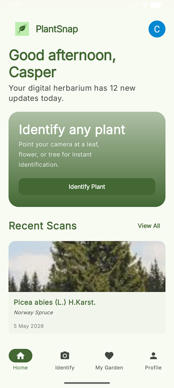
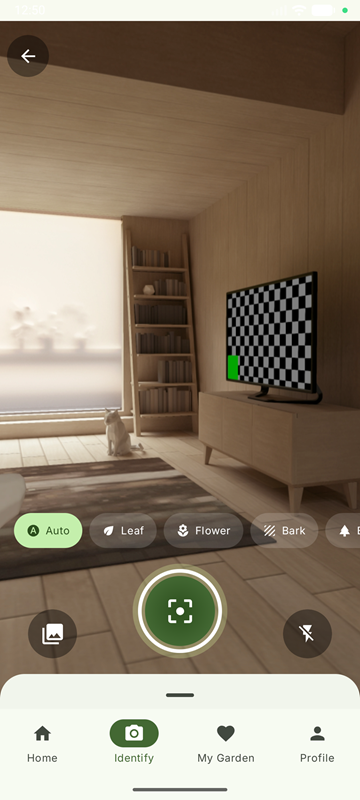
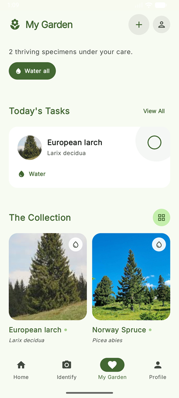
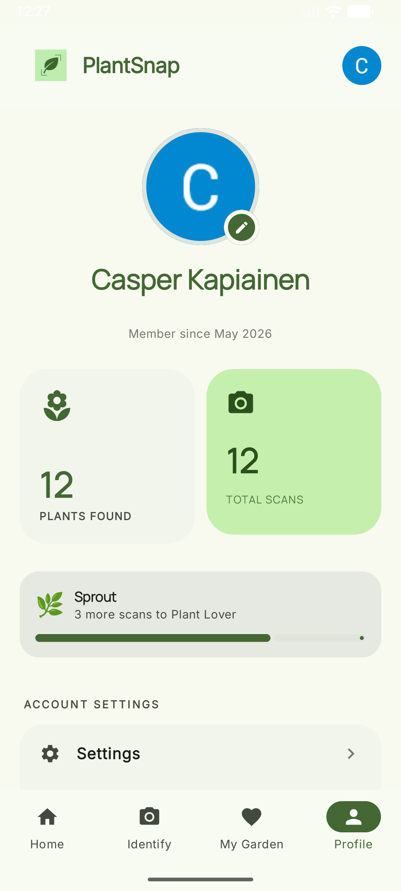

<div align="center">




[](LICENSE)

<br>
AI-powered plant identification <br>
Take a picture of any plant and get an instant species identification with safety information or
identify potential plant diseases

</div>

<div align="center">

##





</div>


<br>

PlantSnap is an Android application built with Kotlin and Jetpack Compose,
as part of a six-week mobile development project by a team of Metropolia UAS software engineering
students.
Users can photograph a plant, select the relevant organ, and receive a
list of species matches powered by the PlantNet API, with additional details generated by Gemini AI.
The app also supports disease scanning — photograph a diseased plant to get ranked disease candidates
with AI-generated symptoms, causes, treatment and prevention information.

---

## Features

- **Live camera preview** — CameraX viewfinder with flash toggle and front/back switch
- **Organ selector** — chip group for leaf, flower, fruit, bark and auto
- **Multi-photo capture** — up to 5 photos per identification scan
- **Gallery picker** — select existing photos via system media picker
- **Plant species identification** — PlantNet API, ranked candidates with confidence scores
- **Disease identification** — PlantNet disease API, ranked disease candidates
- **AI plant details** — Gemini-generated care guide, toxicity, safety, and habitat information
- **AI disease details** — Gemini-generated symptoms, causes, treatment and prevention
- **Safety & toxicity warnings** — dog/cat/human toxicity levels with symptoms
- **Plant of the Day** — daily featured plant generated by Gemini with Wikipedia image
- **My Garden** — save plants with custom nicknames and watering tracking
- **Scan history** — full scan list with navigation to plant details
- **User profiles** — Supabase Auth with Google Sign-In
- **Onboarding** — experience level, plant interests, and pet safety setup
- **Settings** — theme (Light/Dark/System), temperature unit, language, notification toggles
- **Background cloud sync** — scans and saved plants synced to Supabase automatically

---


## Architecture

PlantSnap follows Clean Architecture with three layers — `domain`, `data`, and `ui` — wired together with Hilt. ViewModels expose `StateFlow<UiState<T>>` and repositories return `Flow`, keeping the UI layer fully reactive.

```
app/
└── src/main/java/com/plantsnap/
    ├── data/
    │   ├── local/              # Room — ScanDao, SavedPlantDao, PlantDetailsDao, entities
    │   ├── plantnet/           # Retrofit — PlantNetService + DTOs
    │   ├── remote/
    │   │   ├── supabase/       # Supabase DI module, ProfileRepositoryImpl
    │   │   └── wikipedia/      # Wikipedia API for Plant of the Day images
    │   └── repository/         # GeminiRepositoryImpl, ScanRepositoryImpl, SavedPlantRepositoryImpl …
    ├── domain/
    │   ├── models/             # ScanResult, Candidate, DiseaseCandidate, SavedPlant, PlantAiInfo …
    │   └── repository/         # Repository interfaces
    └── ui/
        ├── components/         # Shared composables (DetailTopBar, ConfidenceBadge, SafetyDisclaimerBanner …)
        ├── navigation/         # AppNavigation — NavHost, bottom nav, nested graphs
        ├── screens/
        │   ├── home/           # HomeScreen, PlantOfTheDayDetailScreen
        │   ├── identify/
        │   │   ├── camera/     # CameraScreen, ImagePreviewScreen
        │   │   ├── identify/   # IdentificationScreen, PlantDetailScreen
        │   │   └── disease/    # DiseaseIdentificationScreen, DiseaseDetailScreen
        │   ├── garden/         # MyGardenScreen, SavedPlantDetailScreen
        │   ├── history/        # HistoryScreen
        │   ├── profile/        # ProfileScreen, AuthenticationScreen, SettingsScreen
        │   └── onboarding/     # OnboardingScreen (experience, interests, pet safety, complete)
        ├── state/              # UiState sealed class (Idle / Loading / Success / Error)
        └── theme/              # Material 3 colour scheme + typography
```

---

## Technology

| Layer                    | Technology                                | Reason                                           |
|--------------------------|-------------------------------------------|--------------------------------------------------|
| UI                       | Jetpack Compose + Material 3              | Declarative UI, modern Android standard          |
| Navigation               | Compose Navigation                        | Type-safe routes, single-activity pattern        |
| Camera                   | CameraX (`LifecycleCameraController`)     | Lifecycle-aware, handles device fragmentation    |
| Dependency Injection     | Hilt 2.59.2                               | Compile-time verified, integrates with ViewModel |
| Networking               | Retrofit + OkHttp + Kotlinx Serialization | Type-safe API calls, efficient JSON parsing      |
| Local Storage            | Room + DataStore                          | Structured scan history, user preferences        |
| Cloud                    | Supabase (Auth + PostgreSQL + Storage)    | Auth, real-time sync, and image storage          |
| Image Loading            | Coil 3                                    | Kotlin-first, Compose-native                     |
| Maps                     | Google Maps Compose                       | Habitat location display                         |
| Plant Identification     | PlantNet API                              | Open, well-documented, 30 000+ species           |
| Disease Identification   | PlantNet API (disease project)            | Same API, dedicated disease model                |
| AI Detail                | Gemini API (Google GenAI SDK)             | Structured plant/disease information generation  |
| Location                 | Play Services Location                    | Geo-tag scans, habitat map pins                  |

---

## Setup

### Prerequisites

- Android studio Meerkat or later
- JDK 11
- Android emulator or device running API 26+

### 1. Clone the repository

```bash
git clone https://github.com/<your-username>/PlantSnap.git
cd PlantSnap
```

### 2. Add API keys

Create a 'local.properties' file in the project root

```properties
PLANTNET_API_KEY=your_plantnet_api_key
SUPABASE_URL=your_supabase_project_url
SUPABASE_KEY=your_supabase_anon_key
GOOGLE_SERVER_CLIENT_ID=your_google_oauth_client_id
GOOGLE_API_KEY=your_gemini_api_key
MAPS_API_KEY=your_google_maps_api_key
```

- **PlantNet API key** — register at [my.plantnet.org](https://my.plantnet.org)
- **Supabase credentials** — create a project at [supabase.com](https://supabase.com)
- **Google OAuth Client ID** — configure OAuth 2.0 in Google Cloud Console (used for Google Sign-In via Credential Manager)
- **Google API key** — enable the Gemini API in [Google AI Studio](https://aistudio.google.com)
- **Maps API key** — enable the Maps SDK for Android in Google Cloud Console

### 3. Run

Open the project in Android Studio and run the 'app' configuration on an emulator or connected
device.

---

## Testing

```bash
# Unit tests
./gradlew test

# Instrumented UI tests (requires emulator or device)
./gradlew connectedDebugAndroidTest

# Coverage report
./gradlew jacocoTestReport
```

Tests are also run automatically on every push to 'main' via GitHub Actions. The CI pipeline runs
lint,
build the depub APK, and executes instrumented tests on an API 35 emulator

---

## Tech stack

```
Language        Kotlin 2.2.10
Min SDK         26 (Android 8.0)
Target SDK      36 (Android 16)
UI              Jetpack Compose BOM 2026.03.00 + Material 3
DI              Hilt 2.59.2
Camera          CameraX 1.4.1
Database        Room 2.8.4
Networking      Retrofit 2.11.0 + OkHttp 4.12.0
Serialization   Kotlinx Serialization 1.7.3
Auth + Cloud    Supabase 3.1.1 (Auth, PostgREST, Storage)
AI              Google GenAI SDK 1.47.0
Maps            Google Maps Compose 8.3.0
Build           Gradle 9.2.1 + AGP 9.0.1
CI              GitHub Actions
```

---

## License

MIT License — see [LICENSE](LICENSE) for details.
