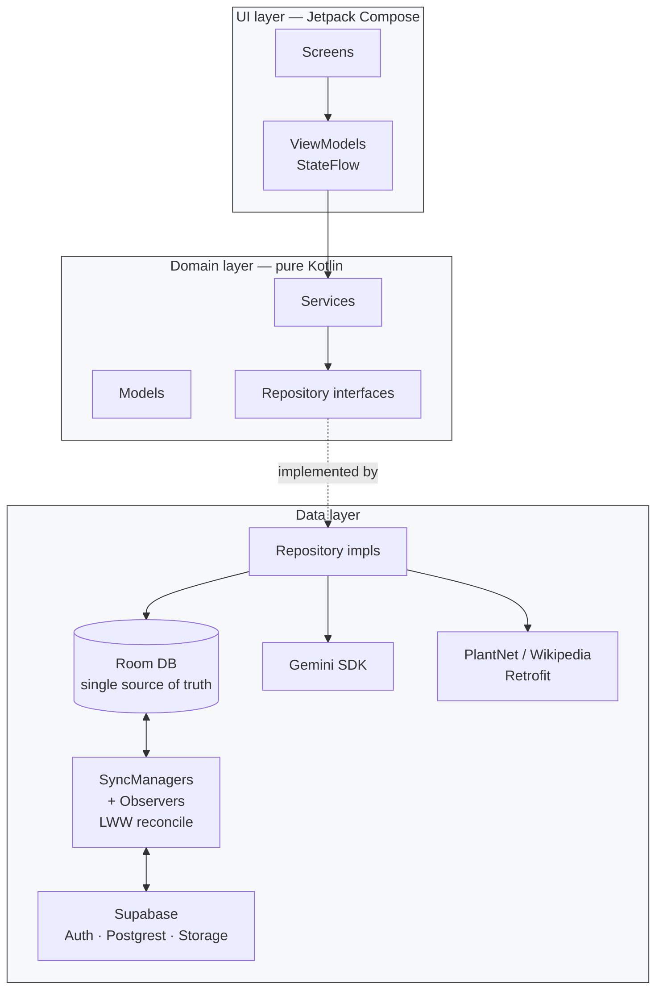

# PlantSnap — Architecture

**Pattern: offline-first MVVM + Clean Architecture (`data` / `domain` / `ui`)**

- **UI layer** — Jetpack Compose + Navigation Compose, one `ViewModel` per screen exposing `StateFlow`; screens grouped by feature (`identify`, `garden`, `home`, `profile`).
- **Domain layer** — pure Kotlin: `models/` (e.g. `CareTask`, `SavedPlant`), `repository/` interfaces, `services/` (e.g. `PlantService`), `safety/`. No Android or framework deps — keeps it unit-testable.
- **Data layer** — repository implementations bridge three remote sources and one local DB:
  - **Local**: Room (`PlantSnapDatabase`) — single source of truth for the UI.
  - **Remote**: Supabase (Auth + Postgrest + Storage), Retrofit clients for PlantNet & Wikipedia, Google Gen AI SDK for Gemini.
  - **Sync**: per-entity `SyncManager` + `SyncObserver` pairs (`SavedPlant`, `Scan`, `CareTask`). Writes go to Room first, marked `synced=false`; observers push to Supabase on auth/connectivity changes; pulls reconcile via **last-write-wins on `updatedAt`**.
- **DI** — Hilt modules per boundary (`DatabaseModule`, `SupabaseModule`, `GeminiModule`, `PlantNetModule`, `WikipediaModule`); `@Singleton` for clients and sync managers.
- **Cloud schema** — Supabase Postgres with RLS gated on `auth.uid() = user_id`; FKs mirror Room (`care_tasks → saved_plants` ON DELETE CASCADE).
- **Why this shape** — UI stays responsive offline, network failures degrade gracefully, and each remote can evolve behind its repository without touching ViewModels.

## Diagram

